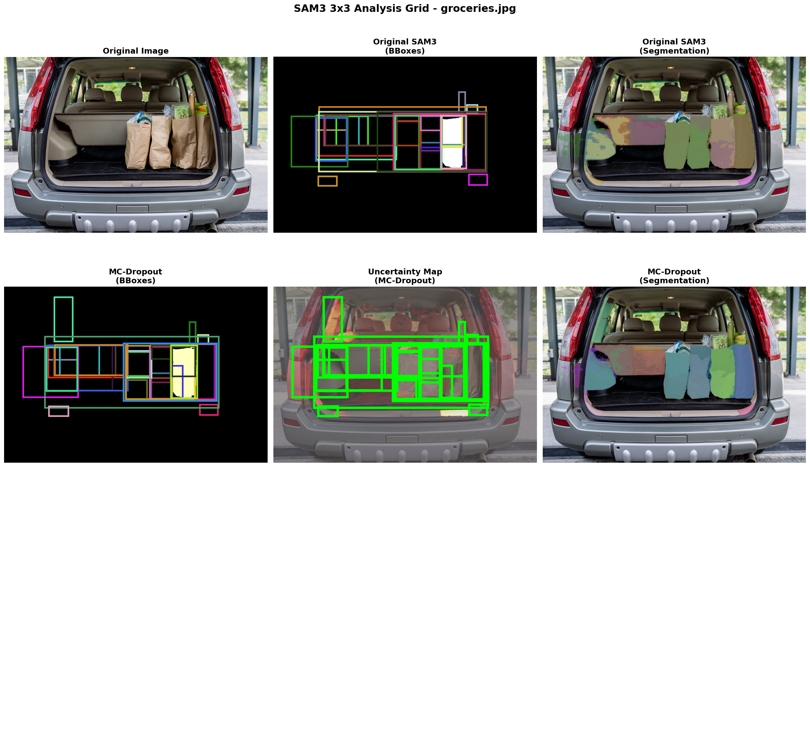
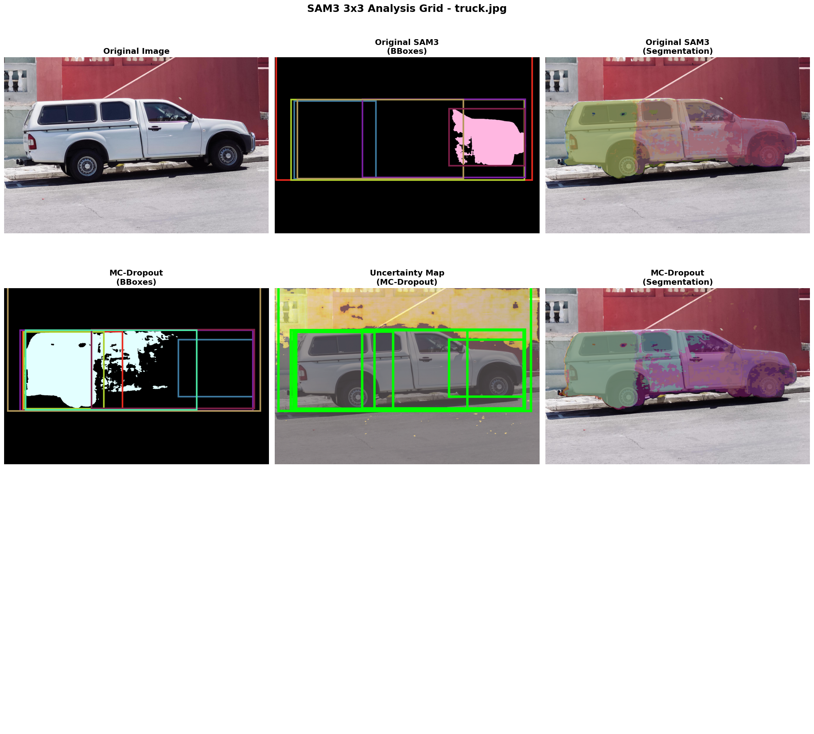

## 🎓 Course Project: Uncertainty-Aware Segmentation with SAM3

**61.502 Deep Learning for Enterprise | Y2026 | SUTD**

> Inference-Time Uncertainty Estimation for Instance Segmentation using Monte Carlo Dropout on SAM3

### Team Members

| Name | Student ID |
|------|-----------|
| Shiva Prasad | 1009737 |
| Duan Xu | 1010728 |
| Lee Kai Boo | 1011130 |

### Project Overview

This project implements **Monte Carlo (MC) Dropout** at inference time on SAM3 to estimate prediction uncertainty without any retraining. By selectively enabling dropout in the decoder and mask head layers, we obtain stochastic predictions whose per-pixel variance and entropy capture useful model uncertainty signals.[file:56]

**Key Results (1000-image COCO val2017 subset, seed=42):**
- ✅ Spearman ρ = **0.4498** (p = 0.0000, N = 559)[file:56]
- ✅ Baseline mean best-IoU = **0.2307**; MC-Dropout mean best-IoU = **0.2401**[file:56]
- ✅ Simplified 10-bin ECE proxy = **0.3264**[file:56]
- ✅ Inference time = **0.81s/image at T=3** and **~5.4s/image at T=20**[file:56]
- ✅ Qualitative uncertainty maps consistently highlight ambiguous boundaries and difficult regions[ file:56]

📄 **Final Report:** `report/SAM3_Final_Report.pdf`

### Repository Structure

| File / Folder | Description |
|---|---|
| `inference_script.py` | Main MC-Dropout inference pipeline |
| `coco_eval.py` | COCO subset evaluation script for uncertainty-error correlation |
| `create_stitched_images.py` | Utility script for stitched qualitative visualisations |
| `spearman_results.json` | Final quantitative results |
| `assets/figures/` | Selected qualitative result figures used in the report |
| `report/` | Final project report PDF |

### Selected Qualitative Results

| Groceries scene | Truck scene |
|---|---|
|  |  |

### Environment Setup

```bash
# Create conda environment in project directory
conda create --prefix ./env python=3.12 -y
source /opt/conda/bin/activate ./env

# Install PyTorch with CUDA
pip install torch==2.10.0 torchvision --index-url https://download.pytorch.org/whl/cu128

# Install SAM3 and dependencies
pip install -e .
pip install -e ".[notebooks]"
pip install pycocotools scipy
```

### Hugging Face Authentication

SAM3 checkpoints require Hugging Face authentication.

```bash
hf auth login
```

### Running Inference

Place test images in:

```bash
assets/uncertainImages/
```

Then run:

```bash
python inference_script.py
```

Outputs will be written to:

```bash
inference_results_uncertainty/
```

Typical outputs include:
- segmentation visualisations
- uncertainty maps
- entropy maps
- stitched comparison figures

### Reproducing Evaluation Results

First download the COCO 2017 annotations:

```bash
wget http://images.cocodataset.org/annotations/annotations_trainval2017.zip
python -c "import zipfile; zipfile.ZipFile('annotations_trainval2017.zip').extractall('.')"
```

Then download the reproducible 1000-image subset:

```bash
python coco/download_1000.py
```

Move the downloaded images into:

```bash
assets/uncertainImages/
```

Then run evaluation:

```bash
python coco_eval.py
```

Expected output file:

```bash
spearman_results.json
```

Expected main result:

- Spearman rho = **0.4498**
- p-value = **0.0000**
- N = **559**[file:56]

### Reproducing Report Figures

**Qualitative stitched comparisons**
```bash
python inference_script.py
```

Expected figure outputs include:
- `inference_results_uncertainty/stitched_comparison_3x3_1_groceries.png`
- `inference_results_uncertainty/stitched_comparison_3x3_2_truck.png`

**Per-image uncertainty and entropy maps**
```bash
python inference_script.py
```

Expected outputs include:
- `inference_results_uncertainty/result_*_uncertainty_map.png`
- `inference_results_uncertainty/result_*_entropy_map.png`

### Key Parameters

| Parameter | Value | Notes |
|---|---|---|
| MC samples `T` | 3, 20 | Both reported in the final evaluation [file:56] |
| Confidence threshold | 0.1 | Low threshold to retain uncertain predictions [file:56] |
| Active dropout layers | 30 | Decoder / mask-head only [file:56] |
| IoU filter threshold | 0.05 | Filters cases with no meaningful target [file:56] |
| Random seed | 42 | Reproducible subset selection [file:56] |

### Hardware Notes

- NVIDIA GPU with CUDA 12.6+[file:56]
- Python 3.12[ file:56]
- PyTorch 2.10.0[file:56]
- Tested on SUTD AI Mega Cluster[file:56]

### Reproducibility Notes

The course rubric requires the repository to clearly document installation, usage, dependencies, and exact steps needed to recreate the figures and results presented in the report.[file:2]

This repository therefore includes:
- documented scripts
- selected qualitative figures
- final quantitative results
- reproducibility commands
- final report PDF[file:2]

> Note: COCO images are not uploaded to GitHub because of space constraints. Download them separately before running the pipeline.[file:2]

---

# SAM 3: Segment Anything with Concepts

Meta Superintelligence Labs

[[Paper](https://ai.meta.com/research/publications/sam-3-segment-anything-with-concepts/)]  
[[Project](https://ai.meta.com/sam3)]  
[[Demo](https://segment-anything.com/)]  
[[Blog](https://ai.meta.com/blog/segment-anything-model-3/)]


SAM 3 is a unified foundation model for promptable segmentation in images and videos. It supports text and visual prompts including points, boxes, and masks.[file:82]

## Installation

### Prerequisites

- Python 3.12 or higher
- PyTorch 2.7 or higher
- CUDA-compatible GPU with CUDA 12.6 or higher

```bash
conda create -n sam3 python=3.12
conda activate sam3
pip install torch==2.10.0 torchvision --index-url https://download.pytorch.org/whl/cu128
pip install -e .
pip install -e ".[notebooks]"
```

## Examples

The `examples/` directory contains notebooks demonstrating image prompting, video prompting, batched inference, and SA-Co evaluation workflows.[file:82]

## License

This project is licensed under the SAM License. See `LICENSE` for details.[file:82]
